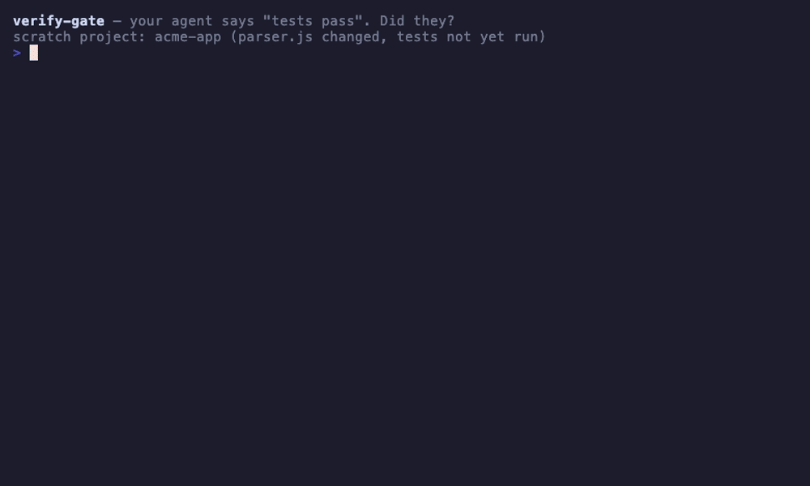

# claude-pilot

[](https://github.com/bhargavch19/claude-pilot/actions/workflows/test.yml)
[](./LICENSE)

A Claude Code plugin marketplace for shipping production-quality code with an
AI agent — anchored by **pilot**, a unified coding conductor that auto-routes
your intent to the right skill (grill → plan → TDD → debug → verify → ship)
and enforces CLAUDE.md quality gates with *deterministic shell hooks*, not
model promises.

```
/plugin marketplace add bhargavch19/claude-pilot
```



*The real hooks, live: the agent claims "done, all tests pass" → the Stop
hook **blocks** (no captured test run this session) → a real `node --test`
run is captured with its actual exit code → the same claim clears. Regenerate
with `vhs demo/demo.tape`.*

## Plugins

Install any plugin independently — the skills work standalone. `pilot` is the
flagship that wires them (and ~20 more ecosystem skills) into one routed
workflow.

| Plugin | What it does | Install |
|---|---|---|
| **pilot** | Intent router + 14 quality-gate hooks + 3 bundled MCPs. The full conductor. | `/plugin install pilot@pilot` |
| **verify-gate** | Just the un-fakeable verification pair: capture real test exit codes, block unverified "done" claims. | `/plugin install verify-gate@pilot` |
| **migration-safety** | Analyze schema migrations, dependency upgrades, and breaking changes before they ship. | `/plugin install migration-safety@pilot` |
| **pre-deploy-checklist** | Pre-deploy gate: secret scan, env vars, feature-flag defaults, smoke tests, rollback path. | `/plugin install pre-deploy-checklist@pilot` |
| **post-deploy-monitor** | Watch error rate, latency, and logs for the first 15–60 minutes after a deploy. | `/plugin install post-deploy-monitor@pilot` |
| **ceo-review** | Adversarial plan review — poke holes, right-size scope, decide expand-or-kill. | `/plugin install ceo-review@pilot` |
| **office-hours** | Pressure-test whether an idea is worth building before any code is written. | `/plugin install office-hours@pilot` |

The skill plugins wire **no hooks and no MCP servers** — they add one skill
each. `verify-gate` wires exactly three hook entries (the verification pair —
byte-identical to pilot's copies, CI-enforced; don't install alongside full
pilot or the gate fires twice). Only `pilot` installs the complete hook suite.

`migration-safety`, `pre-deploy-checklist`, and `post-deploy-monitor` are
structured scaffolds today: they register their phase, run a documented
checklist, and redirect to a working fallback where depth is still queued
(see `docs/superpowers/plans/2026-05-20-production-hardening.md`).
`ceo-review` and `office-hours` are vendored from garrytan/gstack (MIT).

## Why pilot

Most "AI coding workflow" setups rely on the model remembering to behave.
Pilot doesn't:

- **Deterministic routing.** A UserPromptSubmit hook (`route-advisor.sh`)
  computes the unambiguous part of the route *in code* from `registry.md`
  before the model even sees your prompt. Fuzzy intent stays model-judged;
  literal skill names and project state (`.planning/` → GSD, `.paul/` → PAUL)
  are hard-routed.
- **Un-fakeable verification.** `capture-test-run.sh` records the *actual*
  exit codes of test commands; the blocking `verify-gate.sh` clears a "done"
  claim only when a real captured pass exists this session. The model cannot
  write "tests passed" without having run them.
- **Witnessed approvals.** Autopilot checkpoints require a real human prompt
  (recorded by `approval-capture.sh`); the model can't synthesize one.
- **Autopilot.** `/pilot-autopilot <requirement>` conducts the whole loop
  hands-off — frame → plan → *(your approval)* → TDD build → verify → bounded
  fix loop → review → *(your approval)* → ship — with durable state in
  `.pilot/cycles/` that survives session death.
- **Extensible in one line.** New skill = one row appended to
  `plugins/pilot/skills/pilot/registry.md`. New guardrail = a hook script + a
  test.

## Quick install

In Claude Code:

```
/plugin marketplace add bhargavch19/claude-pilot
/plugin install pilot@pilot
```

Restart Claude Code. The hook events (PreToolUse on Edit/Write/MultiEdit/
NotebookEdit + Bash, PostToolUse, Stop, SubagentStop, SessionStart, PreCompact,
UserPromptSubmit) wire automatically via the plugin manifest, the
`/pilot-*` slash commands become available, and the bundled MCP servers start
in the background.

**Bundled MCP servers** (all pinned, all start automatically):

| Server | Pinned version | First-run cost | Used in phases |
|---|---|---|---|
| `context7` | `@2.2.5` | ~3MB npx fetch | Docs lookup (any) |
| `playwright` | `@0.0.75` | ~3MB npx + ~300MB Chromium on first navigate | Verify (UI) |
| `github` | hosted (`api.githubcopilot.com/mcp`) | none — remote HTTP | Review · Ship |

**API keys + opt-outs** — export in your shell before launching Claude Code:

```bash
export CONTEXT7_API_KEY="…"      # optional — raises context7 rate limits
export GITHUB_TOKEN="…"          # required for the hosted github MCP (reads too)

# Per-server opt-outs (set to 1 to skip that MCP's routing):
export PILOT_DISABLE_CONTEXT7=1
export PILOT_DISABLE_PLAYWRIGHT=1
export PILOT_DISABLE_GITHUB=1
```

Verify any install with `/pilot-doctor`.

## Dev install (symlink + live edit)

For hacking on pilot without going through marketplace publishing:

```bash
git clone https://github.com/bhargavch19/claude-pilot ~/Workspace/claude-pilot
bash ~/Workspace/claude-pilot/plugins/pilot/dev/symlink-pilot.sh   # does all 3 steps
# restart Claude Code, then run /pilot-doctor
```

`symlink-pilot.sh` chains three idempotent steps:

1. **Symlink** every `plugins/*/skills/*` dir into `~/.claude/skills/` (live edits show up immediately).
2. **Wire hooks** — `wire-hooks.sh` merges pilot's hook entries into `~/.claude/settings.json` via `jq` (auto-backed up to `settings.json.bak.<ts>`).
3. **Register MCPs** — `wire-mcps.sh` reads `mcpServers` from pilot's `plugin.json` and registers them via `claude mcp add` (skips existing entries).

Each step is also runnable atomically. Use `SKIP_WIRE=1` to refresh only the
symlinks. To remove:

```bash
bash ~/Workspace/claude-pilot/plugins/pilot/dev/unwire-hooks.sh   # idempotent
bash ~/Workspace/claude-pilot/plugins/pilot/dev/unwire-mcps.sh    # idempotent
```

## Repository layout

```
.claude-plugin/marketplace.json    # the marketplace — this repo IS the marketplace
plugins/
  pilot/                           # flagship: routing skill + hooks + commands + MCPs
    .claude-plugin/plugin.json
    skills/pilot/                  # SKILL.md, registry.md (phase table), guardrails.md, playbooks/
    hooks/                         # 14 shell hooks across 7 hook events
    commands/                      # /pilot-* slash commands
    dev/                           # wire/unwire/dev-install/eval tooling
    templates/board/               # vendored story board (own CI job)
  migration-safety/                # standalone plugins — one skill each, no hooks
  pre-deploy-checklist/
  post-deploy-monitor/
  ceo-review/
  office-hours/
tests/                             # bash+jq fixture tests for every hook + routing eval
web/                               # guide pages (SDLC walkthrough)
```

See [`CHANGELOG.md`](./CHANGELOG.md) for what shipped in each version and
[`prereqs.md`](./prereqs.md) for the ecosystem skills pilot prefers to route
into.

## How to invoke pilot

Three invocation tiers, in order of explicit-ness:

### Tier 1 — just describe the work

Pilot's `description` frontmatter contains trigger keywords that Claude Code
auto-matches: **build, fix, ship, explore, messy, broken, review**. A normal
work prompt is enough.

```
build a scientific-mode toggle for the calc app
```

### Tier 2 — name your tools explicitly (recommended)

If your prompt literally contains a skill id or MCP name, pilot pre-resolves
every named token to a phase on parse — no keyword scoring, no ambiguity.

```
Build feature X.
Use context7 to confirm the library docs.
Plan via writing-plans, then TDD it.
Verify with playwright. Screenshot the result.
Finally run improve-codebase-architecture.
```

→ resolves to a five-phase chain (`context7` → `superpowers:writing-plans` →
`tdd` → `playwright` → `improve-codebase-architecture`), no clarifying
questions.

**Match rules:** multi-word skill names must appear as one hyphenated token;
namespace prefixes are optional (`writing-plans` → `superpowers:writing-plans`);
matching is case-insensitive; generic vocabulary doesn't count ("design the
UI" does not match `frontend-design`).

### Tier 3 — force-prefix with `pilot:`

```
pilot: think through whether to extract this into a separate package
```

The literal `pilot:` prefix pushes pilot to route even on exploratory prompts
with no trigger keywords.

## Production phases

Beyond the core Frame → Plan → Build → Verify → Review → Ship → Capture cycle,
pilot routes production-oriented phases at decimal slots:

| Slot | Phase | Primary skill | Fires when |
|---|---|---|---|
| 0.5 | Triage | `triage` | "what to work on", incoming bugs, PR queue |
| 0.75 | Bootstrap | `init` | repo has no CLAUDE.md |
| 4.5 | Performance | `diagnose` | "slow", "latency", "profile", "regression" |
| 6.5 | Security | `security-review` | "audit", "OWASP", diff touches auth/crypto/network |
| 6.75 | Documentation | `gsd-docs-update` | "document", "update README", "API docs" |
| 7.5 | Migration | `migration-safety:migration-safety` | diff touches `migrations/` or lockfile |
| 7.6 | Dependencies | `migration-safety:migration-safety` | "update deps", "outdated packages", "CVE" |
| 7.75 | Pre-deploy | `pre-deploy-checklist:pre-deploy-checklist` | immediately before Ship on a release branch |
| 8.25 | Release | `claude-mem:version-bump` | "release", "version bump", "changelog", "tag" |
| 8.5 | Post-deploy | `post-deploy-monitor:post-deploy-monitor` | after Ship completes |

Each phase is a row in `plugins/pilot/skills/pilot/registry.md` with its
triggers and fallbacks; ordering is enforced by the **Resolution rule** column.

## Bypass

| When you want to… | Use |
|---|---|
| Skip the next gate fire | `/pilot-off` |
| Skip only plan-gate | `/pilot-bypass --no-plan` |
| Turn pilot off for the session | `/pilot-off-rails` |
| Turn pilot back on | `/pilot-back-on` |
| Diagnose what's wired and what isn't | `/pilot-doctor` |
| Quick wired-hooks view | `/pilot-status` |
| Inspect current session's routing chain | `/pilot-trace` |

Free-text bypass phrases (`pilot off`, `pilot off rails`, `pilot --no-plan`)
also work mid-conversation.

## Configuration

Per-repo config via `.pilot.json` at the repo root (resolved from cwd or the
git root):

```json
{
  "test_patterns": ["rake test", "my-custom-runner"],
  "verify_gate": "run",
  "test_command": "bash tests/run.sh",
  "test_timeout": 120,
  "autopilot": { "gate": "warn", "max_fix_rounds": 3, "checkpoints": ["plan", "ship"] }
}
```

`verify_gate` modes: default **blocks** a "done" claim on a source-changing
turn unless a real test run was captured this session; `"warn"` downgrades to
advisory; `"run"` makes the gate execute `test_command` itself and use the
real exit code. The gate honors bypass markers and auto-releases after two
consecutive blocks so it can never trap a session.

Team-mode knobs (branch-scoped autopilot cycles, shared outcome ledgers,
published cycle state, pinned bootstrap via `dev/skills-lock.json`, A/B
measurement) are documented in [`docs/team-onboarding.md`](./docs/team-onboarding.md)
and [`docs/ab-method.md`](./docs/ab-method.md).

## Known limitations

Honest list of edges that bite — surfaced via cross-setup audit, not
theoretical.

| Area | Limitation | Workaround / status |
|---|---|---|
| **Platform** | All hooks are bash. Windows PowerShell users can't run them natively. | Use WSL or Git Bash; full PowerShell port queued. |
| **macOS cache** | Hooks write to `~/.cache/pilot/` (XDG convention), not `~/Library/Caches/`. | Set `XDG_CACHE_HOME=~/Library/Caches` if you want the native location. |
| **Web app** | claude.ai/code doesn't fire local hooks. | Hooks enforce in CLI/desktop sessions; skill-level routing still works. |
| **Pre-commit on amend** | Only inspects the current `-m`/`--message`; rebase-amended commits bypass the conventional-commit check. | Run `bash tests/run.sh` before pushing rebased branches. |
| **Plan-gate freshness** | Any plan file matching the known locations satisfies the gate, even a stale one. | Treat as a soft guard; `/pilot-bypass --no-plan` for small unrelated edits. |
| **Built-in skill detection** | `/pilot-doctor` can't file-probe Claude Code built-in skills. | Doctor marks them `• built-in — file probe N/A`. |
| **Wire-hooks dedup** | Dev-install dedup is by hook basename, not absolute path — two dev installs collide. | `unwire-hooks.sh` before switching install paths. |

## Tests

```bash
bash tests/run.sh                      # fixture tests for every hook + routing eval
bash plugins/pilot/dev/dry-run.sh      # end-to-end simulation with realistic Claude Code JSON
```

Plain bash + jq; no extra deps. CI runs both on ubuntu-latest and macos-latest,
plus shellcheck, manifest validation for every plugin, and the vendored board
suite.

## Contributing

See [`CONTRIBUTING.md`](./CONTRIBUTING.md) — adding a skill or plugin is
deliberately small: a `SKILL.md`, a manifest, a registry row, and a test.

## License

MIT — see [`LICENSE`](./LICENSE). `ceo-review` and `office-hours` are vendored
from garrytan/gstack (MIT); the story board template is vendored per
`plugins/pilot/templates/board/VENDORED.md`.
